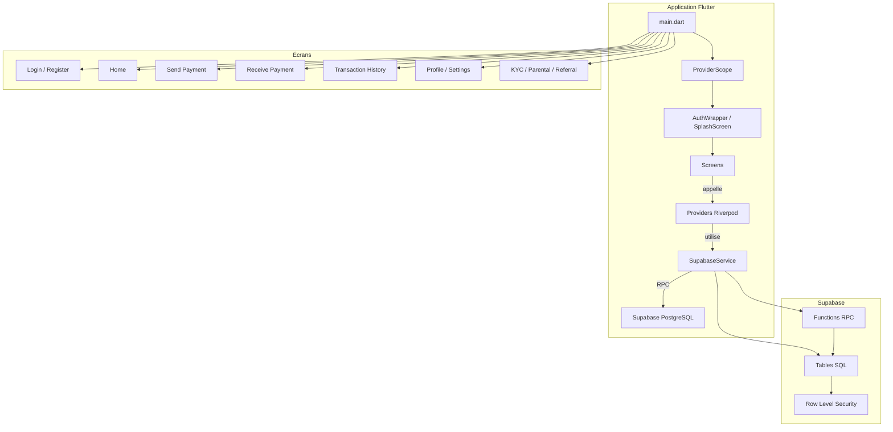
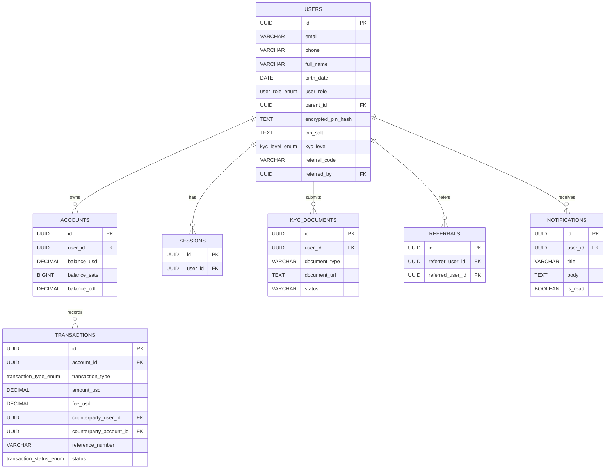

# Architecture du projet Crypto-Pay

## Vue d'ensemble

Ce document décrit l'architecture complète de l'application mobile Crypto-Pay.

- Frontend : Flutter
- Gestion d'état : Riverpod
- Backend : Supabase (PostgreSQL + RPC)
- Thème : Liquid Glass
- Authentification : Passport Supabase + stockage local

---

## Diagramme d'architecture globale


```

---

## Composants principaux

### Frontend Flutter

- `lib/main.dart`
  - Initialisation Supabase
  - Chargement du thème
  - Démarrage de l'application avec `ProviderScope`

- `lib/config.dart`
  - Variables de configuration Supabase via `--dart-define`

- `lib/core/theme.dart`
  - Thème sombre et design tokens
  - Typographie Google Fonts

- `lib/services/supabase_service.dart`
  - Interface entre Flutter et Supabase
  - Appels RPC exposés comme méthodes Dart

- `lib/providers/user_provider.dart`
  - Providers pour l'état utilisateur
  - Persistence avec `SharedPreferences`

- `lib/screens/`
  - Ecrans de l'application mobile
  - Navigation et UX

### Backend Supabase

- `supabase/migrations/20240601000000_initial_schema.sql`
  - Création du schema `cryptopay`
  - Définition des tables, types et fonctions RPC

- Tables clé :
  - `cryptopay.users`
  - `cryptopay.accounts`
  - `cryptopay.transactions`
  - `cryptopay.sessions`
  - `cryptopay.kyc_documents`
  - `cryptopay.referrals`
  - `cryptopay.notifications`

- Fonctions RPC clé :
  - `register_user`
  - `verify_login`
  - `get_user_salt`
  - `send_payment`
  - `create_lightning_invoice`
  - `get_balance`
  - `get_transaction_history`
  - `search_users`
  - `create_child_account`
  - `approve_child_transaction`
  - `submit_kyc_document`
  - `get_notifications`

- Sécurité : Row Level Security (RLS)
  - Politiques pour limiter l'accès aux données de l'utilisateur connecté

---

## Diagramme des relations de données


```

---

## Flux utilisateur principal

### Inscription / connexion

1. L'utilisateur remplit le formulaire `register_screen`
2. `SupabaseService.registerUser()` appelle `register_user`
3. Le RPC crée l'utilisateur, le compte, et génère un code de parrainage
4. En cas de connexion, `verify_login` valide le PIN hash

### Paiement

1. L'utilisateur saisit un destinataire dans `send_payment_screen`
2. `SupabaseService.sendPayment()` appelle `send_payment`
3. Le RPC vérifie le solde, calcule les frais, et enregistre la transaction
4. Une notification peut être créée via `create_notification`

### KYC / parrainage / enfants

- `submit_kyc_document` gère l'envoi de documents
- `create_child_account` et `approve_child_transaction` gèrent les comptes enfants
- `claim_referral_bonus` gère le bonus de parrainage

---

## Résumé de l'architecture

- L'application est séparée en couches : UI, état, service, données.
- La logique métier critique est implémentée côté base de données via Supabase RPC.
- Les données sont sécurisées par RLS et la structure SQL.
- Riverpod pilote l'accès aux données et la synchronisation UI.

---

## Utilisation

- Ouvrir `ARCHITECTURE.md` pour la documentation architecturale.
- Render le diagramme Mermaid dans un visualiseur Markdown compatible.
- Mettre à jour les sections si tu ajoutes de nouveaux écrans ou RPC.
