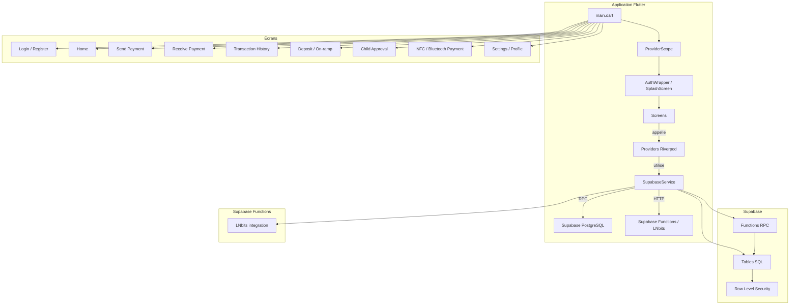

# Architecture du projet Crypto-Pay

## Vue d'ensemble

Ce document décrit l'architecture actuelle de l'application mobile Crypto-Pay.

- Frontend : Flutter
- Gestion d'état : Riverpod
- Backend : Supabase (PostgreSQL + RPC)
- Intégration Lightning : Breez SDK côté client et LNbits côté backend
- Authentification : Supabase + PIN local + RLS

---

## Diagramme d'architecture globale


```

---

## Composants principaux

### Frontend Flutter

- `lib/main.dart`
  - Initialisation de Supabase
  - Chargement du thème et du provider scope
  - Choix du premier écran selon l'état de connexion

- `lib/config.dart`
  - Variables de configuration Supabase via `--dart-define`

- `lib/core/theme.dart`
  - Thème principal et design tokens Liquid Glass
  - Style d'interface et couleurs

- `lib/services/supabase_service.dart`
  - Wrapper des appels RPC Supabase
  - Méthodes Dart pour `register_user`, `verify_login`, `send_payment`, `create_lightning_invoice`, `deposit_funds`, etc.
  - Expose aussi les fonctions d'approbation parentale

- `lib/services/breez_service.dart`
  - Intégration du SDK Breez pour la gestion de Lightning côté mobile

- `lib/services/nfc_service.dart`
  - Lecture/écriture de données NFC pour paiement local

- `lib/services/bluetooth_service.dart`
  - Recherche d'appareils BLE et communication pour paiement local

- `lib/screens/`
  - `login_screen.dart`
  - `register_screen.dart`
  - `home_screen.dart`
  - `send_payment_screen.dart`
  - `receive_payment_screen.dart`
  - `pay_menu_screen.dart`
  - `deposit_screen.dart`
  - `nfc_payment_screen.dart`
  - `bluetooth_payment_screen.dart`
  - `parent_approval_screen.dart`
  - `transaction_history_screen.dart`
  - `profile_screen.dart`
  - `settings_screen.dart`
  - `kyc_submission_screen.dart`
  - `referral_screen.dart`

### Backend Supabase

- `supabase/migrations/20240601000000_initial_schema.sql`
  - Création du schema `cryptopay`
  - Tables, types, énumérations et premières fonctions RPC

- `supabase/migrations/20260705_patch_functions.sql`
  - Patch standalone pour mettre à jour les fonctions clefs sans relancer la migration complète
  - Ajoute `deposit_funds`
  - Met à jour `send_payment` et `approve_child_transaction`

- Tables clé :
  - `cryptopay.users`
  - `cryptopay.accounts`
  - `cryptopay.transactions`
  - `cryptopay.child_limits`
  - `cryptopay.pending_approvals`
  - `cryptopay.limits`
  - `cryptopay.kyc_documents`
  - `cryptopay.referrals`
  - `cryptopay.notifications`

- Fonctions RPC clé :
  - `register_user`
  - `verify_login`
  - `get_user_salt`
  - `send_payment`
  - `create_lightning_invoice`
  - `get_balance`
  - `get_transaction_history`
  - `search_users`
  - `create_child_account`
  - `approve_child_transaction`
  - `deposit_funds`
  - `submit_kyc_document`
  - `get_notifications`

- Sécurité : Row Level Security (RLS)
  - Politiques pour limiter l'accès aux données à l'utilisateur connecté
  - Le schéma `cryptopay` est isolé via `search_path` et fonctions `SECURITY DEFINER`

### Intégration Lightning / On-ramp

- `supabase/functions/lnd-integration/index.ts`
  - Serveurless Deno fonction connectée à LNbits
  - Crée et paie des factures Lightning via l'API LNbits
  - Met à jour `transactions` et appelle le backend Supabase pour mettre à jour les soldes

- `lib/screens/deposit_screen.dart`
  - Écran d'alimentation de compte côté mobile
  - Appelle `deposit_funds` pour créditer un compte via un flux de recharge partenaire simulé

---

## Flux utilisateur principal

### Inscription / connexion

1. L'utilisateur remplit le formulaire de création de compte.
2. `SupabaseService.registerUser()` appelle la procédure RPC `register_user`.
3. Le RPC crée l'utilisateur, le compte associé et le code de parrainage.
4. Au login, `verify_login` valide le PIN hash contre les informations stockées.

### Paiement standard

1. L'utilisateur choisit `Send Payment` ou un mode local (QR, NFC, Bluetooth).
2. `SupabaseService.sendPayment()` appelle `send_payment`.
3. Le RPC vérifie le solde, calcule les frais, applique les limites, et enregistre la transaction.
4. Pour les comptes enfants, le paiement peut rester `pending` jusqu'à approbation parentale.

### Paiement Lightning / Récupération

1. L'utilisateur génère ou paye une facture Lightning via l'app.
2. Le backend serveurless LNbits est utilisé pour créer ou régler des factures.
3. Les transactions Lightning sont consignées dans `transactions` et les soldes sont ajustés.

### Alimentation de compte / On-ramp

1. `DepositScreen` permet de saisir un montant et un libellé.
2. `SupabaseService.depositFunds()` appelle la nouvelle RPC `deposit_funds`.
3. La fonction crédite le compte et enregistre un `receive` transaction.
4. Ce flux est actuellement un MVP « recharge partenaire » à remplacer par un PSP réel.

### Gestion des comptes enfants

- `create_child_account` crée un compte enfant lié à un parent.
- `approve_child_transaction` gère l'approbation parentale et exécute le paiement autorisé.
- Les plafonds enfant sont contrôlés avant l'autorisation et mis à jour après paiement.

---

## Résumé de l'architecture

- Le projet est structuré en couches : UI, services, logique métier, données.
- La logique métier critique est portée côté base de données via Supabase RPC et fonctions PL/pgSQL.
- Les paiements locaux passent par NFC/Bluetooth, les paiements Lightning passent par Breez et LNbits.
- L'alimentation de compte est implémentée comme un flux backend `deposit_funds` et reste à formaliser pour la production.
- Riverpod orchestre les états, Supabase gère l'authentification, les données et les RPC sécurisés.

---

## Utilisation

- Ouvrir `ARCHITECTURE.md` pour comprendre la structure du projet.
- Mettre à jour ce fichier lorsque de nouveaux écrans, RPC ou intégrations backend sont ajoutés.
- Pour les migrations, préférer `supabase/migrations/20260705_patch_functions.sql` pour appliquer les corrections sans relancer toute la migration initiale.
